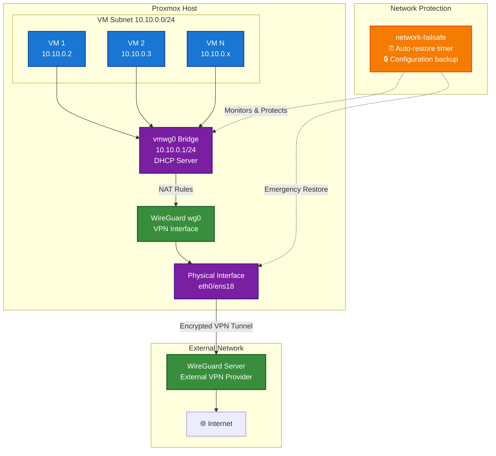

# Proxmox: подсеть ВМ через WireGuard

Ansible-скрипты для создания подсети ВМ на Proxmox. Весь трафик ВМ идет через WireGuard VPN. С защитой от потери доступа к серверу.

## Содержание

- [Proxmox: подсеть ВМ через WireGuard](#proxmox-подсеть-вм-через-wireguard)
  - [Содержание](#содержание)
  - [Требования](#требования)
  - [Что получится](#что-получится)
  - [Архитектура сети](#архитектура-сети)
    - [Поток трафика](#поток-трафика)
  - [Структура проекта](#структура-проекта)
  - [Быстрый старт](#быстрый-старт)
    - [Настройка переменных](#настройка-переменных)
  - [Защита от ошибок конфигурации сети](#защита-от-ошибок-конфигурации-сети)
    - [Как работает](#как-работает)
    - [Команды](#команды)
    - [Если что-то пошлось не так](#если-что-то-пошлось-не-так)
      - [Из консоли серверa Proxmox](#из-консоли-серверa-proxmox)
  - [Тестирование системы](#тестирование-системы)
    - [Быстрая проверка](#быстрая-проверка)
    - [Ручное тестирование](#ручное-тестирование)
    - [Проверка сети](#проверка-сети)

## Требования

- Proxmox VE
- Ansible
- SSH доступ к Proxmox хосту
- Данные WireGuard сервера

## Что получится

- **Мост vmwg0** (10.10.0.1/24) — к нему подключаются ВМ
- **DHCP** через dnsmasq раздает IP 10.10.0.2-254
- **VPN**: весь трафик ВМ через WireGuard
- **Защита**: откатывается автоматически, если что-то сломается

## Архитектура сети



### Поток трафика

1. **ВМ** отправляют трафик через мост `vmwg0`
2. **NAT** перенаправляет трафик с подсети 10.10.0.0/24 на интерфейс `wg0`
3. **WireGuard** шифрует и отправляет через физический интерфейс
4. **VPN-сервер** расшифровывает и отправляет в интернет
5. **Защита** следит за конфигурацией и восстанавливает при сбое

## Структура проекта

```text
├── deploy-vmwg-subnet.yml      # основной плейбук
├── cleanup-vmwg-subnet.yml     # удаление всего
├── inventory.yml               # ваш конфиг (создать из .example)
├── inventory.example.yml       # пример конфига
├── ansible.cfg                 # настройки Ansible
├── verify-setup.sh             # проверка готовности
├── src/
│   └── network-failsafe        # скрипт защиты сети
└── templates/                  # шаблоны конфигов
    ├── debug-vmwg0.sh.j2       # диагностика
    ├── dnsmasq-default.conf.j2 # базовая настройка dnsmasq
    ├── dnsmasq-vmwg0.conf.j2   # DHCP для vmwg0
    ├── dnsmasq@.service.j2     # systemd сервис
    ├── vmwgnat.j2              # сетевой интерфейс
    └── wg0.conf.j2             # конфиг WireGuard
```

## Быстрый старт

1. Скопировать пример конфига

   ```bash
   cp inventory.example.yml inventory.yml
   ```

2. Заполнить свои данные в [inventory.yml](inventory.yml)

3. Изменить конфигурацию ansible в [ansible.cfg](ansible.cfg), если не используете WSL

4. Развернуть

   ```bash
   ansible-playbook deploy-vmwg-subnet.yml
   ```

5. В случае неудовлетворения, можно откатить изменения:

   ```bash
   ansible-playbook cleanup-vmwg-subnet.yml
   ```

### Настройка переменных

В `deploy-vmwg-subnet.yml` можно изменить:

```yaml
vars:
  vm_subnet: "10.10.0.0/24" # подсеть ВМ
  vm_gateway: "10.10.0.1" # шлюз
  vm_dhcp_range_start: "10.10.0.2" # начало DHCP
  vm_dhcp_range_end: "10.10.0.254" # конец DHCP
  routing_table_id: 200 # ID таблицы маршрутизации
```

## Защита от ошибок конфигурации сети

Чтобы не потерять доступ к серверу при настройке сети:

### Как работает

1. Сохраняет текущие настройки
2. Ставит таймер на 5 минут
3. Если все ОК — отключается сама
4. Если сломалось — откатывает обратно

### Команды

```bash
network-failsafe status          # статус
network-failsafe test            # тест на 15 секунд
network-failsafe arm 300         # включить на 5 минут
network-failsafe disarm          # выключить
```

### Если что-то пошлось не так

```bash
# Откат изменений
ansible-playbook cleanup-vmwg-subnet.yml
```

#### Из консоли серверa Proxmox

```bash
# Проверить процессы защиты
ps aux | grep network-failsafe

# Почистить зависшие процессы
pkill -f network-failsafe
rm -f /tmp/network-failsafe.lock

# Логи
tail -20 /var/log/network-failsafe.log

# Восстановление сети через систему защиты
network-failsafe restore
```

## Тестирование системы

### Быстрая проверка

SSH на Proxmox и запустить:

```bash
# Статус защиты
network-failsafe status

# Автотест (15 сек, безопасно)
network-failsafe test

# Диагностика сети
/root/debug-vmwg0.sh
```

### Ручное тестирование

```bash
# Включить защиту на 1 минуту
network-failsafe arm 60

# Посмотреть что происходит
tail -f /var/log/network-failsafe.log

# Досрочно выключить (опционально)
network-failsafe disarm
```

### Проверка сети

```bash
# Интерфейсы
ip addr show vmwg0

# Сервисы
systemctl status wg-quick@wg0
systemctl status dnsmasq@vmwgnat

# NAT правила
iptables -t nat -L POSTROUTING | grep 10.10.0

# Таблица маршрутизации
ip rule show | grep 200
```
