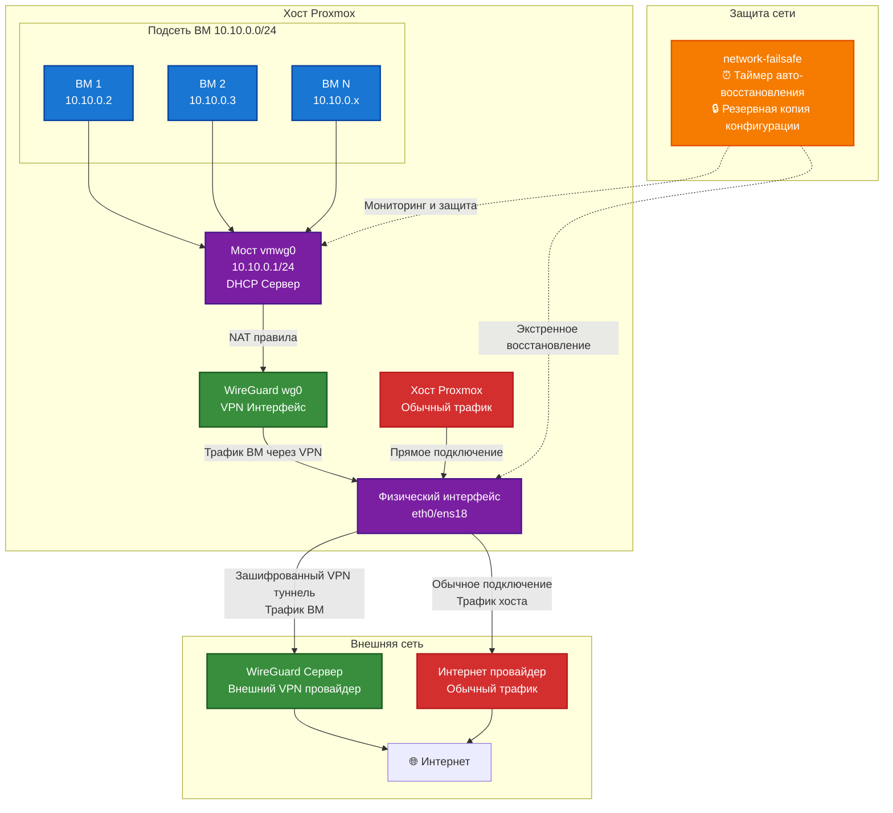

# Proxmox: подсеть ВМ через WireGuard

Ansible-скрипты для создания подсети ВМ на Proxmox. Весь трафик ВМ идет через WireGuard VPN. С защитой от потери доступа к серверу.

**✅ Совместимо с Proxmox SDN** - использует стандартные механизмы Proxmox и не конфликтует с Software-Defined Networking.

## Содержание

- [Proxmox: подсеть ВМ через WireGuard](#proxmox-подсеть-вм-через-wireguard)
  - [Содержание](#содержание)
  - [Требования](#требования)
  - [Что получится](#что-получится)
  - [Архитектура сети](#архитектура-сети)
    - [Поток трафика](#поток-трафика)
  - [Структура проекта](#структура-проекта)
  - [Быстрый старт](#быстрый-старт)
    - [Настройка переменных](#настройка-переменных)
  - [Совместимость с Proxmox SDN](#совместимость-с-proxmox-sdn)
  - [Защита от ошибок конфигурации сети](#защита-от-ошибок-конфигурации-сети)
    - [Как работает](#как-работает)
    - [Команды](#команды)
    - [Если что-то пошлось не так](#если-что-то-пошлось-не-так)
      - [Проблема с запуском контейнеров LXC](#проблема-с-запуском-контейнеров-lxc)
      - [Из консоли серверa Proxmox](#из-консоли-серверa-proxmox)
  - [Тестирование системы](#тестирование-системы)
    - [Быстрая проверка](#быстрая-проверка)
    - [Ручное тестирование](#ручное-тестирование)
    - [Проверка сети](#проверка-сети)
  - [Файлы, создаваемые на сервере](#файлы-создаваемые-на-сервере)
    - [Сетевая конфигурация](#сетевая-конфигурация)
    - [WireGuard VPN](#wireguard-vpn)
    - [Сетевой интерфейс](#сетевой-интерфейс)
    - [DHCP сервер (dnsmasq)](#dhcp-сервер-dnsmasq)
    - [Системные сервисы](#системные-сервисы)
    - [Диагностические инструменты](#диагностические-инструменты)
    - [Журналы и мониторинг](#журналы-и-мониторинг)
    - [Скрипты управления и диагностики](#скрипты-управления-и-диагностики)
    - [Зачем такие параметры?](#зачем-такие-параметры)

## Требования

- Proxmox VE
- Ansible
- SSH доступ к Proxmox хосту
- Данные WireGuard сервера

## Что получится

- **Мост vmwg0** (10.10.0.1/24) — к нему подключаются ВМ
- **DHCP** через dnsmasq раздает IP 10.10.0.2-254
- **VPN**: весь трафик ВМ через WireGuard
- **Защита**: откатывается автоматически, если что-то сломается

## Архитектура сети



### Поток трафика

1. **ВМ** отправляют трафик через мост `vmwg0`
2. **NAT правила** перенаправляют трафик ВМ с подсети 10.10.0.0/24 на интерфейс `wg0`
3. **WireGuard** шифрует трафик ВМ и отправляет через физический интерфейс
4. **VPN-сервер** расшифровывает трафик ВМ и отправляет в интернет
5. **Хост Proxmox** использует обычное подключение через провайдера (без VPN)
6. **Защита** следит за конфигурацией и восстанавливает при сбое

**Важно:** Только трафик ВМ идет через VPN, трафик самого хоста Proxmox остается обычным.

## Структура проекта

```text
├── deploy-vmwg-subnet.yml      # основной плейбук
├── cleanup-vmwg-subnet.yml     # удаление всего
├── inventory.yml               # ваш конфиг (создать из .example)
├── inventory.example.yml       # пример конфига
├── ansible.cfg                 # настройки Ansible
├── verify-setup.sh             # проверка готовности
├── src/
│   └── network-failsafe        # скрипт защиты сети
└── templates/                  # шаблоны конфигов
    ├── debug-vmwg0.sh.j2       # диагностика
    ├── debug-dnsmasq.sh.j2     # диагностика dnsmasq
    ├── dnsmasq-default.conf.j2 # базовая настройка dnsmasq
    ├── dnsmasq-vmwg0.conf.j2   # DHCP для vmwg0
    ├── dnsmasq@.service.j2     # systemd сервис
    ├── vmwgnat.j2              # сетевой интерфейс
    └── wg0.conf.j2             # конфиг WireGuard
```

## Быстрый старт

1. Скопировать пример конфига

   ```bash
   cp inventory.example.yml inventory.yml
   ```

2. Заполнить свои данные в [inventory.yml](inventory.yml)

3. Изменить конфигурацию ansible в [ansible.cfg](ansible.cfg), если не используете WSL

4. Развернуть

   ```bash
   ansible-playbook deploy-vmwg-subnet.yml
   ```

5. В случае неудовлетворения, можно откатить изменения:

   ```bash
   ansible-playbook cleanup-vmwg-subnet.yml
   ```

## Совместимость с Proxmox SDN

Этот проект полностью совместим с Proxmox Software-Defined Networking (SDN):

✅ **Использует стандартные механизмы Proxmox**  
✅ **Не конфликтует с SDN зонами**  
✅ **Поддерживает D-Bus интеграцию для SDN**  
✅ **Безопасен при обновлениях Proxmox**  

### Техническая реализация

- Использует стандартный `/lib/systemd/system/dnsmasq@.service` template
- Создает `/etc/default/dnsmasq.vmwgnat` для конфигурации
- Наш сервис работает без D-Bus, SDN зоны - с D-Bus
- Каждый сервис изолирован по интерфейсам

Подробности в [PROXMOX-SDN-COMPATIBILITY.md](PROXMOX-SDN-COMPATIBILITY.md)

### Настройка переменных

В `deploy-vmwg-subnet.yml` можно изменить:

```yaml
vars:
  vm_subnet: "10.10.0.0/24" # подсеть ВМ
  vm_gateway: "10.10.0.1" # шлюз
  vm_dhcp_range_start: "10.10.0.2" # начало DHCP
  vm_dhcp_range_end: "10.10.0.254" # конец DHCP
  routing_table_id: 200 # ID таблицы маршрутизации
```

## Защита от ошибок конфигурации сети

Чтобы не потерять доступ к серверу при настройке сети:

### Как работает

1. Сохраняет текущие настройки
2. Ставит таймер на 5 минут
3. Если все ОК — отключается сама
4. Если сломалось — откатывает обратно

### Команды

```bash
network-failsafe status          # статус
network-failsafe test            # тест на 15 секунд
network-failsafe arm 300         # включить на 5 минут
network-failsafe disarm          # выключить
```

### Если что-то пошлось не так

```bash
# Откат изменений
ansible-playbook cleanup-vmwg-subnet.yml
```

#### Проблема с запуском контейнеров LXC

Если контейнеры не запускаются с ошибкой D-Bus:

```text
The name uk.org.thekelleys.dnsmasq.dhcpsnat was not provided by any .service files
```

**Причина:** Конфликт интерфейсов или порядка запуска сервисов.

**Решение:** Повторно запустите плейбук (исправления применены):

```bash
ansible-playbook deploy-vmwg-subnet.yml
```

**Что исправлено:**
- Изменено на `bind-dynamic` (ждет появления интерфейса)
- Добавлены systemd зависимости от сетевых интерфейсов
- Улучшен порядок запуска сервисов
- Убрана ненужная D-Bus интеграция (упрощение архитектуры)

Подробнее смотрите в файлах [DNSMASQ-INTERFACE-FIX.md](DNSMASQ-INTERFACE-FIX.md) и [DBUS-REMOVAL-EXPLANATION.md](DBUS-REMOVAL-EXPLANATION.md).

#### Из консоли серверa Proxmox

```bash
# Проверить процессы защиты
ps aux | grep network-failsafe

# Почистить зависшие процессы
pkill -f network-failsafe
rm -f /tmp/network-failsafe.lock

# Логи
tail -20 /var/log/network-failsafe.log

# Восстановление сети через систему защиты
network-failsafe restore
```

## Тестирование системы

### Быстрая проверка

SSH на Proxmox и запустить:

```bash
# Статус защиты
network-failsafe status

# Автотест (15 сек, безопасно)
network-failsafe test

# Диагностика сети
/root/debug-vmwg0.sh
```

### Ручное тестирование

```bash
# Включить защиту на 1 минуту
network-failsafe arm 60

# Посмотреть что происходит
tail -f /var/log/network-failsafe.log

# Досрочно выключить (опционально)
network-failsafe disarm
```

### Проверка сети

```bash
# Интерфейсы
ip addr show vmwg0

# Сервисы
systemctl status wg-quick@wg0
systemctl status dnsmasq@vmwgnat

# Проверка совместимости с Proxmox SDN
systemctl status dnsmasq@dhcpsnat  # должен работать без конфликтов

# NAT правила
iptables -t nat -L POSTROUTING | grep 10.10.0

# Таблица маршрутизации
ip rule show | grep 200
```

## Файлы, создаваемые на сервере

### Сетевая конфигурация

**`/etc/network/interfaces.d/vmwgnat`** - конфигурация моста vmwg0

```bash
# Мост для ВМ с политиками маршрутизации
auto vmwg0
iface vmwg0 inet static
    address 10.10.0.1/24
    bridge_ports none          # виртуальный мост без физических портов
    bridge_stp off            # отключаем STP для производительности
    bridge_fd 0               # убираем задержку forward delay

    # Политики маршрутизации - трафик ВМ через отдельную таблицу
    up ip rule add from 10.10.0.0/24 table 200 priority 100
    up ip route add default via 10.8.0.10 dev wg0 table 200  # через VPN

    # NAT для подсети ВМ через WireGuard
    up iptables -t nat -A POSTROUTING -s 10.10.0.0/24 -o wg0 -j MASQUERADE
    up iptables -A FORWARD -i vmwg0 -o wg0 -j ACCEPT
    up iptables -A FORWARD -i wg0 -o vmwg0 -m state --state RELATED,ESTABLISHED -j ACCEPT
```

**`/etc/network/interfaces`** - основной файл сети (добавляется блок)

```bash
# VM Subnet Bridge with WireGuard VPN routing
auto vmwg0
iface vmwg0 inet static
    address 10.10.0.1/24
    bridge_ports none
    bridge_stp off
    bridge_fd 0
```

### WireGuard VPN

**`/etc/wireguard/wg0.conf`** - конфигурация VPN туннеля

```ini
[Interface]
PrivateKey = ваш_приватный_ключ
Address = 10.8.0.10/24, fdcc:ad94:bacf:61a4::cafe:a/112  # IP в VPN сети
Table = 32768                  # использует отдельную таблицу маршрутизации
# Настройка маршрута по умолчанию в таблице 200 для трафика ВМ
PostUp = ip route add default dev wg0 scope global table 200
PostDown = ip route del default dev wg0 table 200 2>/dev/null || true

[Peer]
PublicKey = публичный_ключ_сервера
PresharedKey = предварительный_ключ
Endpoint = ваш.сервер.com:51820
AllowedIPs = 0.0.0.0/0, ::/0   # весь трафик через VPN
PersistentKeepalive = 10       # каждые 10 сек для поддержки соединения
```

### Сетевой интерфейс

**`/etc/network/interfaces.d/vmwgnat`** - конфигурация моста vmwg0

```bash
auto vmwg0
iface vmwg0
address 10.10.0.1/24          # IP шлюза для ВМ
# NAT правила для перенаправления трафика ВМ в VPN
post-up iptables -t nat -A POSTROUTING -s '10.10.0.0/24' -o wg0 -j MASQUERADE
post-down iptables -t nat -D POSTROUTING -s '10.10.0.0/24' -o wg0 -j MASQUERADE
# Правила для Proxmox firewall зон
post-up iptables -t raw -I PREROUTING -i fwbr+ -j CT --zone 1
post-down iptables -t raw -D PREROUTING -i fwbr+ -j CT --zone 1
# Policy-based routing: трафик от/к ВМ идет через таблицу 200
post-up ip rule add from 10.10.0.0/24 table 200 priority 100
post-down ip rule del from 10.10.0.0/24 table 200 priority 100 2>/dev/null || true
post-up ip rule add to 10.10.0.0/24 table 200 priority 101
post-down ip rule del to 10.10.0.0/24 table 200 priority 101 2>/dev/null || true
# Локальный маршрут в таблице 200
post-up ip route add 10.10.0.0/24 dev vmwg0 table 200 2>/dev/null || true
post-down ip route del 10.10.0.0/24 dev vmwg0 table 200 2>/dev/null || true
bridge_ports none             # виртуальный мост без физических портов
bridge_stp off               # отключаем Spanning Tree Protocol
bridge_fd 0                  # мгновенное переключение портов
ip-forward on                # включаем IP форвардинг
```

### DHCP сервер (dnsmasq)

**`/etc/dnsmasq.d/vmwgnat/00-default.conf`** - базовые настройки

```bash
# Только работаем с vmwg0 интерфейсом (избегаем конфликтов с Proxmox SDN)
interface=vmwg0             # только на vmwg0
except-interface=lo         # не слушаем на loopback
bind-dynamic                # ждем появления интерфейса (не требует его при запуске)
enable-ra                   # Router Advertisement для IPv6
quiet-ra                    # тихий режим RA
no-hosts                    # не читаем /etc/hosts
dhcp-leasefile=/var/lib/misc/dnsmasq.vmwgnat.leases
dhcp-hostsfile=/etc/dnsmasq.d/vmwgnat/ethers  # статические привязки MAC->IP

# Уменьшенный MTU для совместимости с VPN
dhcp-option=26,1380         # MTU 1380 (1500 - 20 IP - 8 UDP - 32 WireGuard - 60 запас)
ra-param=*,mtu:1380,0       # тот же MTU для IPv6

# WPAD опция для Windows
dhcp-option=252,"\n"        # пустая WPAD строка

# Microsoft опция для корректного освобождения DHCP аренды
dhcp-option=vendor:MSFT,2,1i

# Защита от атак через WPAD
dhcp-name-match=set:wpad-ignore,wpad
dhcp-ignore-names=tag:wpad-ignore

# DNS настройки
dhcp-option=6,10.10.0.1     # DNS сервер = gateway (сам dnsmasq)
server=1.1.1.1              # апстрим DNS серверы
server=8.8.8.8
server=2606:4700:4700::1111

# Логирование для отладки
log-queries                 # логируем DNS запросы
log-dhcp                    # логируем DHCP события
log-facility=/var/log/dnsmasq-vmwg.log

# Оптимизация производительности
dhcp-lease-max=150          # максимум 150 аренд
cache-size=1000             # кеш на 1000 записей
```

**`/etc/dnsmasq.d/vmwgnat/10-vmwg0.conf`** - DHCP для ВМ

```bash
# DHCP конфигурация специально для интерфейса vmwg0
dhcp-option=tag:dhcpsnat-10-10-0-0-24,option:router,10.10.0.1  # шлюз
dhcp-range=set:dhcpsnat-10-10-0-0-24,10.10.0.2,10.10.0.254,255.255.255.0,12h
interface=vmwg0             # только на vmwg0
```

### Системные сервисы

**`/etc/systemd/system/dnsmasq@.service`** - шаблон сервиса dnsmasq

```ini
[Unit]
Description=dnsmasq - A lightweight DHCP and caching DNS server (%i)
After=network.target        # запускаем после сети
Wants=nss-lookup.target     # хотим NSS lookup
Before=nss-lookup.target    # но запускаемся до него

[Service]
Type=forking               # процесс форкается в фон
PIDFile=/run/dnsmasq-%i.pid
# Проверяем конфигурацию перед запуском
ExecStartPre=/usr/sbin/dnsmasq --test --conf-dir=/etc/dnsmasq.d/%i,*.conf
# Запускаем с конфигурацией из /etc/dnsmasq.d/%i/
ExecStart=/usr/sbin/dnsmasq --conf-dir=/etc/dnsmasq.d/%i,*.conf --pid-file=/run/dnsmasq-%i.pid
ExecReload=/bin/kill -HUP $MAINPID  # перезагрузка по SIGHUP
Restart=on-failure         # перезапуск при сбое
RestartSec=5              # через 5 секунд

[Install]
WantedBy=multi-user.target  # автозапуск
```

**`/etc/systemd/system/wg-quick@wg0.service.d/override.conf`** - зависимости WireGuard

```ini
[Unit]
After=network-online.target
Wants=network-online.target
# Гарантируем запуск после настройки vmwg0
After=network.target
Requires=network.target
```

### Диагностические инструменты

**`/root/debug-vmwg0.sh`** - скрипт диагностики сети

```bash
#!/bin/bash
# Полная диагностика VPN подсети
echo "=== WireGuard Status ==="
wg show                      # статус WireGuard соединения

echo "=== Interface Status ==="
ip addr show vmwg0          # проверка IP адреса моста
ip addr show wg0            # проверка IP адреса VPN

echo "=== Routing Tables ==="
ip route show table main | head -5    # основная таблица (трафик хоста)
ip route show table 200               # таблица 200 (трафик ВМ)

echo "=== Policy Routing Rules ==="
ip rule show | grep -E "(200|10\.10\.0)" # правила маршрутизации

echo "=== NAT Rules ==="
iptables -t nat -L POSTROUTING -n | grep "10\.10\.0"  # NAT правила

echo "=== Service Status ==="
systemctl is-active wg-quick@wg0      # статус WireGuard
systemctl is-active dnsmasq@vmwgnat   # статус DHCP

echo "=== DHCP Leases ==="
cat /var/lib/misc/dnsmasq.vmwgnat.leases 2>/dev/null || echo "Нет аренд"

echo "=== DNS Resolution Test ==="
nslookup google.com 10.10.0.1         # тест DNS через шлюз ВМ
```

### Журналы и мониторинг

**`/var/log/network-failsafe.log`** - логи системы защиты

```bash
tail -f /var/log/network-failsafe.log  # отслеживание работы защиты
```

**`/var/log/dnsmasq-vmwg.log`** - логи DHCP и DNS

```bash
tail -f /var/log/dnsmasq-vmwg.log      # отслеживание DHCP/DNS
```

### Скрипты управления и диагностики

**`/usr/local/bin/network-failsafe`** - система защиты сети

- Автоматический откат при сбое конфигурации
- Таймер безопасности (по умолчанию 5 минут)
- Резервное копирование настроек в `/var/backups/network-failsafe/`

**`/root/debug-vmwg0.sh`** - диагностический скрипт

```bash
#!/bin/bash
# Проверка состояния всех компонентов системы
echo "=== Диагностика vmwg0 подсети ==="
echo "Интерфейсы:"
ip addr show vmwg0
echo "Сервисы:"
systemctl status wg-quick@wg0 dnsmasq@vmwgnat
echo "NAT правила:"
iptables -t nat -L POSTROUTING -n | grep 10.10.0
echo "Маршрутизация:"
ip rule show | grep 200
ip route show table 200
```

### Зачем такие параметры?

**Bridge настройки:**

- `bridge_stp off` - отключает Spanning Tree Protocol для скорости
- `bridge_fd 0` - убирает задержку включения портов (15 сек → 0 сек)
- `bridge_ports none` - виртуальный мост без физических портов

**WireGuard параметры:**

- `Table = off` - отключает автоматические маршруты, управляем вручную
- `PersistentKeepalive = 25` - каждые 25 сек ping для прохода через NAT
- `AllowedIPs = 0.0.0.0/0` - разрешаем весь трафик через VPN

**Политики маршрутизации:**

- `table 200` - отдельная таблица маршрутизации для ВМ
- `priority 100` - высокий приоритет правила
- Трафик хоста идет через основную таблицу (таблица 254)

**DHCP настройки:**

- `dhcp-authoritative` - быстрые ответы, не ждем других DHCP серверов
- `port=0` - отключаем DNS во избежание конфликтов с Proxmox
- `bind-interfaces` - безопасность, слушаем только нужные интерфейсы
